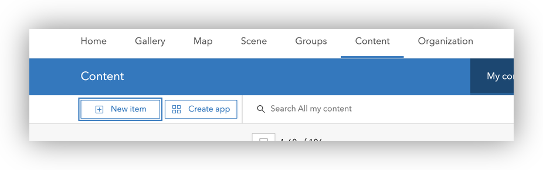
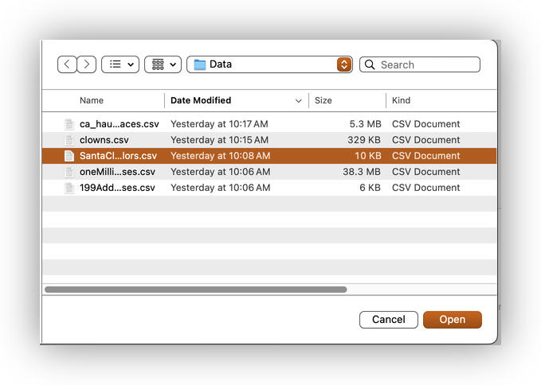
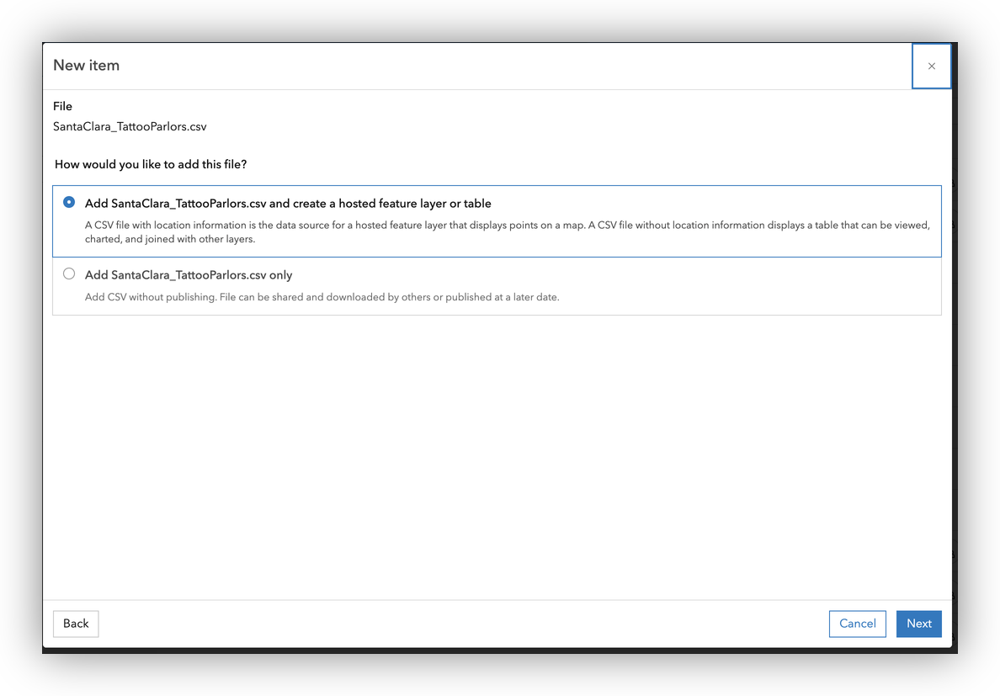
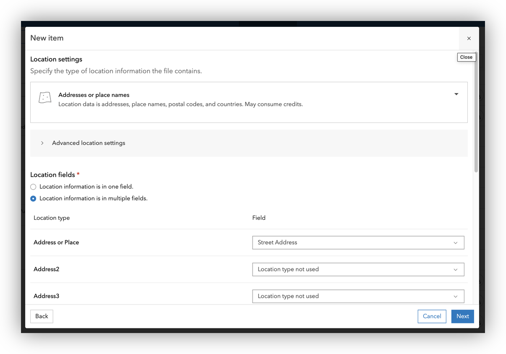
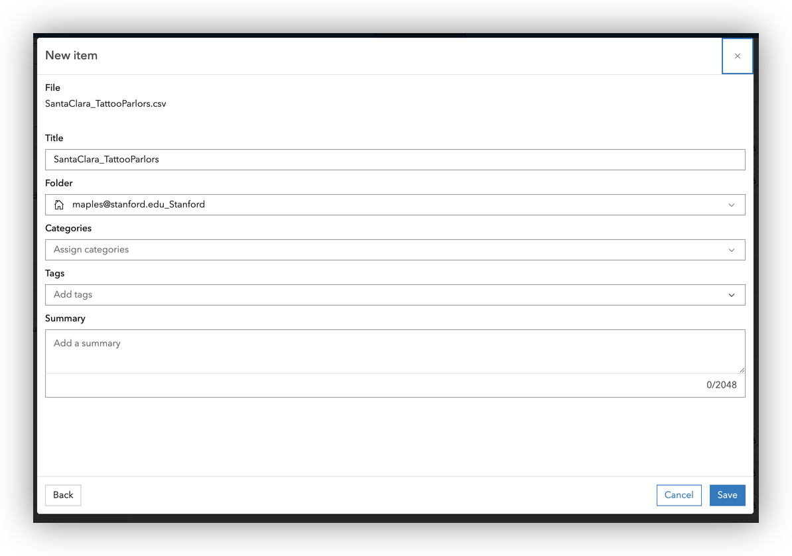
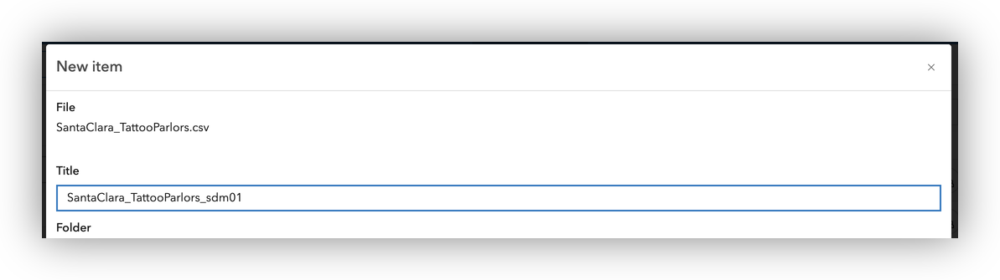
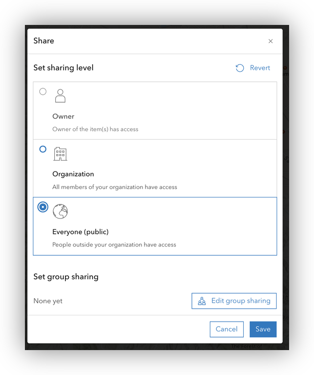
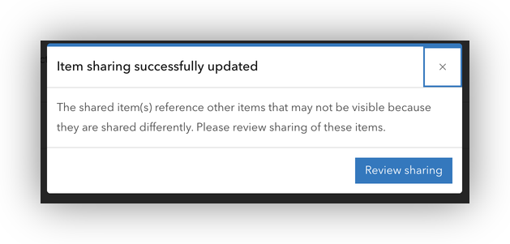
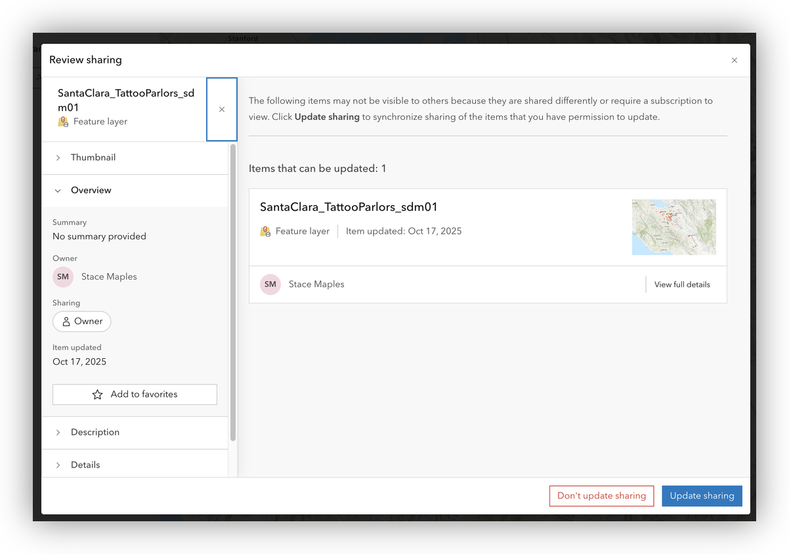

# Geocoding with ArcGIS Online: Santa Clara Tattoo Parlors Example

This guide will walk you through the process of geocoding a business dataset using ArcGIS Online, with a focus on the Santa Clara Tattoo Parlors data. You'll learn how to upload, prepare, and geocode a CSV file, and how to review and use the resulting map.

## About the Dataset

The dataset for this exercise is `SantaClara_TattooParlors.csv`, which contains business information for tattoo parlors in Santa Clara County, California. Each row represents a business and includes fields such as:

- Company Name
- Business Name
- Street Address
- City
- State Abbreviation
- Zip Code
- Telephone Number
- Line of Business
- NAICS/SIC codes
- Sales Volume, Employees, Year Started

You can view or download the dataset here:

- [SantaClara_TattooParlors.csv](Data/SantaClara_TattooParlors.csv)

**Note:** Some ZIP codes may have lost leading zeros if the file was previously opened in spreadsheet software. See the data preparation section for how to address this.

---

## Step 1: Sign in to ArcGIS Online

1. Go to [https://stanford.maps.arcgis.com](https://stanford.maps.arcgis.com) in your web browser.
2. Click **Sign In** and use your Stanford credentials.

   

   

   

## Step 2: Add the Tattoo Parlor CSV to Your Content

1. In the top menu, click **Content**.
2. Click **New item** > **Your device**.

1. Browse to and select `SantaClara_TattooParlors.csv` from your local computer.

1. Accept the default to "**Add SantaClara_TattooParlors.csv and create a hosted feature layer or table**" and Click **Next** and review the detected fields.

1. Confirm importing all fields, and double check the data types. For instance, is the `Zip Code` set to String? Click **Next** once confirmed.

1. Set the Location Setting fields:
   - **Location type:** Addresses or Places
   - **Address field:** `Street Address`
   - **City field:** `City`
   - **State field:** `State Abbreviation`
   - **ZIP Code field:** `Zip Code`

1. Click **Next** and provide a title, tags, and folder location for your new hosted feature layer.

1. Click **Save** to upload and publish the data.

Note: If you get an error about duplicate filenames, simply add your initials, or a successive numeric value to the end of your file name.

## Step 4: Geocode and Map the Data

If you uploaded the CSV as an address table, ArcGIS Online will automatically attempt to geocode the records and display them on the map.

1. Click **Yes** in the dialgo to **Open** the **hosted feature layer** in **Map Viewer**.
2. **Review** the points on the map for accuracy.

## Step 5: Save and Share Your Map

1. In the Map Viewer, click **Save and open** > **Save as** to save your map.

1. Add a title, tags, and summary.

1. To share your map, click **Share** and choose the appropriate sharing settings (e.g., Stanford, public, or specific groups).

1. If the content IN YOUR MAP does not have teh same SHaring Permissions as the settings you just gave to the map, you should be prompted to Review sharing for the content in your map.

1. Use the Update sharing to easily update the Share settings of all content in the current map.

## Tips and Best Practices

- Always check for formatting issues after importing data from spreadsheets.
- Use string fields for ZIP codes to preserve leading zeros.
- Document your workflow for reproducibility.
- For help, contact [stacemaples@stanford.edu](mailto:stacemaples@stanford.edu).

---

[← Back to Geocoding 101 Introduction](README.md)

*Tutorial prepared by the Stanford Geospatial Center*
