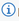

# Geocoding Using ArcGIS Pro (with clowns.csv)

This guide walks you through a complete geocoding workflow in ArcGIS Pro using the Stanford Geospatial Center's [locator.stanford.edu](http://locator.stanford.edu) geocoding services and the `clowns.csv` dataset. You'll learn how to start ArcGIS Pro, log in to Stanford's ArcGIS Online, connect to the locator, import your CSV to a geodatabase, fix ZIP codes with dropped leading zeros, and geocode your data.

## Prerequisites

- ArcGIS Pro installed (on your computer or in the Stanford Geospatial Center Lab)
- Stanford University credentials
- Access to [stanford.maps.arcgis.com](https://stanford.maps.arcgis.com)
- The `clowns.csv` dataset (located in the `Data/` folder)

**Important:** The locator.stanford.edu services are IP-restricted to the Stanford Network. If you cannot connect, ensure you are using the Stanford AnyConnect VPN. For VPN help, visit [Stanford IT VPN documentation](https://uit.stanford.edu/service/vpn).

## Step 1: Start ArcGIS Pro and Log In

1. Launch **ArcGIS Pro**.
2. When prompted, sign in with your Stanford credentials to [stanford.maps.arcgis.com](https://stanford.maps.arcgis.com).

## Step 2: Connect to the Stanford Locator Service

1. In ArcGIS Pro, Start a New Project, with Catalog

1. go to the **Insert** tab.
2. Click **Connections** > **Server** > **New ArcGIS Server**.

1. For **Server URL**, enter: `https://locator.stanford.edu/arcgis`
2. Leave authentication blank and click **OK**.

1. In the **Catalog** pane, expand **Servers>arcgis on locator.stanford.edu.ags>geocode>** and locate the Stanford regional locator services.

1. Right-click the **USA** locator and select **Add To Project**. The locator will appear in your **Locators** folder.

#### Note on ArcGIS World Geocoding Service

*When you open ArcGIS Pro, you will see the **ArcGIS World Geocoding Service** listed by default in the Locators pane (see image below). This service is available to all Stanford users, but **it consumes ArcGIS Online credits for each geocoding transaction**. While it is suitable for small geocoding jobs, for any project involving more than a few thousand records, you should use the Stanford Geospatial Center's locator at **locator.stanford.edu** to avoid unnecessary credit usage and ensure support for research-scale geocoding.*

Begin by downloading the `clowns.csv` dataset and saving it to an easy-to-find folder on your hard drive (for example: `C:\Users\<you>\Documents\Geocoding\Data\` on Windows or `~/Documents/Geocoding/Data/` on macOS/Linux). Create the folder if necessary.

## Adding a new Folder Connection to ArcGIS Pro

**Note**: ArcGIS Pro does not automatically create connections to local directories. You must explicitly add a folder connection for each project (Catalog pane → Project > Folders → Add Folder Connection or click the folder icon ► Add Folder Connection). Adding the connection makes files like clowns.csv visible to ArcGIS Pro and available to geoprocessing tools; folder connections are saved in the project (.aprx) and may need to be recreated when opening the project on another machine.

1. In ArcGIS Pro, open the **Catalog** pane.
2. Under **Project > Folders**, right-click and choose **Add Folder Connection** (or click the folder icon ► **Add Folder Connection**) and browse to the folder where you saved `clowns.csv`. This makes the file easy to find from within ArcGIS Pro.

1. In the **Catalog** pane, expand the newly added folder and confirm `clowns.csv` is visible.

1. Right-click `clowns.csv` and select **Add To (New) or Current Map** (or **Create Table** if prompted).
2. To enable geocoding, right-click the resulting table and choose **Data** > **Export to Table**.

1. Select your project geodatabase as the destination and give the resulting table an appropriate name
2. Click **OK**.

## Step 4: Fix ZIP Codes with Dropped Leading Zeros

**Note:** Spreadsheet software may drop leading zeros from ZIP codes, turning `01234` into `1234`.

To restore ZIP codes:

1. Right-click and Open the Attribute table for your imported data.

1. Click **Add Field** to create a new field:

   - Name: `ZIP_str`
   - Type: **Text (String)**
   - Alias: Zip String

     
   - Save the new field.

     
2. Click on the Select by Attributes button to open the dialog.

   * Selection Type: New Selection
   * Expression: `Where Zipcode is less than 9999`
3. Click Apply to Select all records that are missing a digit.

1. Right-Click on `ZIP_str` and select **Calculate Field**.

1. In the calculation dialog:
   - Leave the option to "Use the selected records" checked
   - Use Esri's **Arcade** scripting language (it's quite similar to Excel's functions, so easy to learn)
   - For this selection, set the column values to: `CONCATENATE('0',Text($feature.ZipCode))`

1. Click on the Switch button  to switch the selection to all valid zipcodes.

   
2. In the calculation dialog:- Leave the option to "Use the selected records" checked

   - Again, use the **Arcade** scripting language
   - For this selection, set the column values to: `Text($feature.ZipCode)`
3. Now *most* ZIP codes (we're ignoring a few with leading 00s) are correctly formatted as 5-digit strings.
4. Edits are saved automatically.
5. Clear your selection by clicking on the Clear button:

   

## Step 5: Geocode Your Data

1. Right-click on the `clowns_table` you just cleaned up and select the **Geocode Table** tool.

### Walking through the geocoding wizard:

1. Choose the appropriate Stanford locator service as the **Input Address Locator**, in this case, the `geocode/USA locator`, you added earlier.
2. Confirm the `clowns_table` as the **Input Table**, and set your **Data Structure** to "**More than one field**"
3. Map your address fields (being sure to remap the `ZIP4` locator field to the `ZIP_str`).
4. Confirm the Output Settings (use the Info   icon to explore info about options)
5. Select `United States` as the "**Limit by Country**" setting.
6. Select `Postal` as the "**Limit by Category**" setting
7. Double-check your setting and Field Mappings in the Final Panel.
8. Click **Run** to geocode your data.

## Step 6: Review Results

The output feature class will be added to your map.

## Check the attribute table for match status and scores.

1. Click **Yes** in the "**Geocoding Complete**" pop-up to begin the review process

1. You can use the **Rematch Addresses Dialog** to investigate and rematch (or approve matches with scores lower than the automatic threshhold)
2. Use the  button to match a record.
3. You can also use the Select from Map button   to physically place a point for a record.

3. Unmatched records may need further cleaning or manual review.
4. Right-click on the new `clowns_table_Geocoded` Layer in the Table of COntents and Select **Zoom to Layer** to see your final geocoded result.

## Additional Geocoding Tips and Best Practices

- Always check for formatting issues after importing data from spreadsheets.
- Document your workflow for reproducibility.
- For help, contact [stacemaples@stanford.edu](mailto:stacemaples@stanford.edu).
- For large datasets, consider breaking into smaller batches and running during off-peak hours.
- Do not use the Stanford locator service with PHI or high-risk data.

## Troubleshooting

- If you cannot connect to [locator.stanford.edu](https://locator.stanford.edu), verify VPN/network status and server URL. (If you can see the Info Page at that link, you should be good to go!)
- Low match rates? Review data quality, field mapping, and locator choice.
- Service unavailable? Check [stanfordgis mailing list](https://mailman.stanford.edu/mailman/listinfo/stanfordgis) or contact support.

## Resources

- [Esri's Geocoding Documentation for ArcGIS Pro](https://pro.arcgis.com/en/pro-app/latest/help/data/geocoding/what-is-geocoding.htm)
- [Stanford Geospatial Center](https://library.stanford.edu/research/stanford-geospatial-center)

---

[← Back to Geocoding 101 Introduction](README.md)

*Tutorial prepared by the Stanford Geospatial Center*
